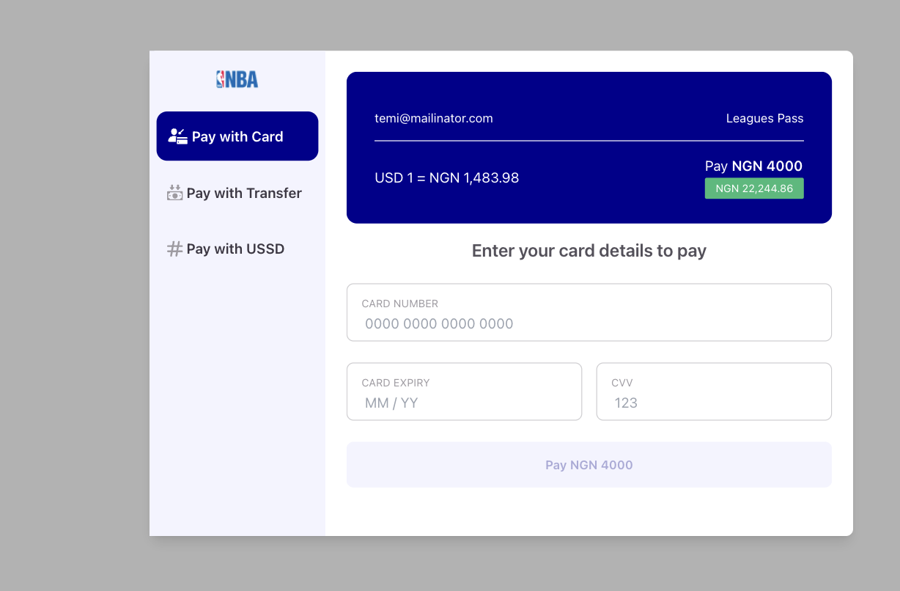

# React Spotflow Checkout

this is a React SDK Library for the Spotflow Payment Checkout

## DEMO

<!--  -->


## Getting Started

This Library is a wrapper around the payment checkout to your React Application

### Install

```bash
  yarn add  @spot-flow/react-spotflow-checkout 
```

or With NPM

```bash
   npm install @spot-flow/react-spotflow-checkout 
```

### Usage

This library can be implemented using the following

1. By Using the Button PaymentCheckoutButton component
2. By Using the the Checkout Provider and the logic Hook (preferred method)

### 1. Using the Payment CheckoutButton

```javascript
import { PaymentCheckoutButton } from "@spot-flow/react-spotflow-checkout";
import React from "react";
import ReactDOM from "react-dom/client";

ReactDOM.createRoot(document.getElementById("root")!).render(
  <React.StrictMode>
    <div>
      <PaymentCheckoutButton
        data={{
          amount: 4000,
          currency: "NGN",
          email: "temi@mailinator.com",
          fullname: "Hammed Chigozie",
          phone: "09090909090",
          productId: "9e0808304344834034",
          productName: "Leagues Pass",
          merchantKey: "<sk_test_f998479c0eedhXXXXXXXXXXXXXXXX>"// <This is your Merchant Key generated for you Merchant on Spotflow> 
        }}
        actionText="Pay Money"
      />
    </div>
  </React.StrictMode>,
);

```

### 2. Using the Checkout Provider and the logic hooks

```javascript
import {
  // PaymentCheckoutButton,
  PaymentContextProvider,
  useSpotflowPayment,
} from "@spot-flow/react-spotflow-checkout";
import React from "react";
import ReactDOM from "react-dom/client";

const PaymentConponents = () => {
  const initialFn = useSpotflowPayment({
    amount: 4000,
    currency: "NGN",
    email: "temi@mailinator.com",
    merchantKey: "",
    reference: "",
    plan: "",
  });
  return (
    <div>
      <button
        type="button"
        onClick={() => {
          initialFn({
            config: undefined,
          });
        }}
        className=" bg-primary-main text-black"
      >
        Apaysjbdjbs
      </button>
    </div>
  );
};

ReactDOM.createRoot(document.getElementById("root")!).render(
  <React.StrictMode>
    <div>
      <PaymentContextProvider>
        <PaymentConponents />
      </PaymentContextProvider>
    </div>
  </React.StrictMode>,
);

```

the Button has the ButtonProps which can allow you to customize to your design

```javascript
import React from "react";


export declare type InitialiseConfig = {
  /**
   * plan Id from spotflow
   */
  plan: string;
  fullname?: string;
  email: string;
  phone?: string;
  /**
   * @type {"USD" | "EUR" | "NGN" | "GBP"}
   * Acceptable currency are USD, EUR, NGN, GBP
   */
  currency?: "USD" | "EUR" | "NGN" | "GBP" | string;
  amount: number;
  /**
   * merchant generated secret key
   */
  merchantKey: string;
  reference?: string;
};

export type CheckoutPaymentProps = React.ComponentProps<"button"> & {
  data: CheckoutData;
  actionText: string;
};
```

## License

This project is licensed under the MIT License - see the <a href="/LICENSE">LICENSE.md</a> file for details
